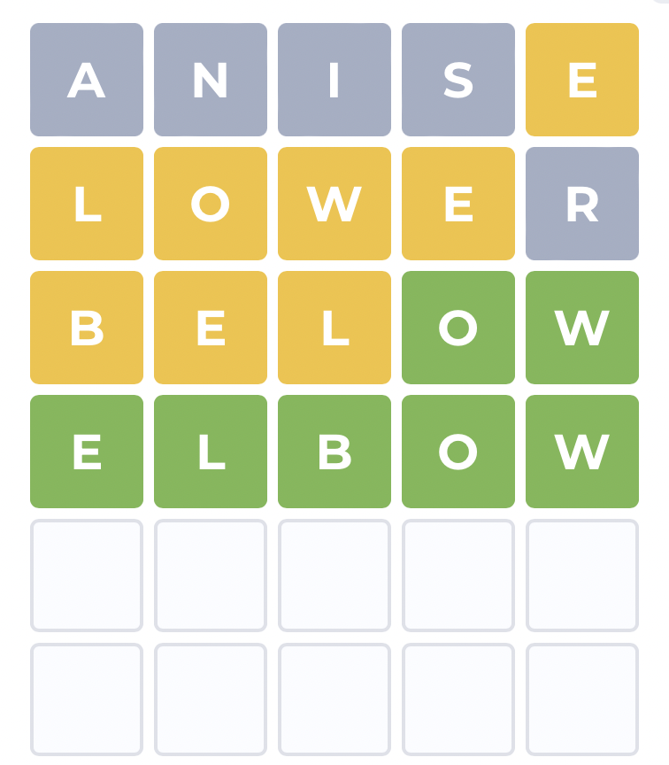

# Solve Wordle
Shows the words that could be the answer to the game.

## Example:
```text
Correct: 
ElseWhere: e 5
Absent: anis

19690     bebed
19706     bebog
...............

Correct: 
ElseWhere: lowe 1234
Absent: r

20581    below
60163    elbow

Correct: ow 45
ElseWhere: bel 123
Absent: 

60163    elbow
```

